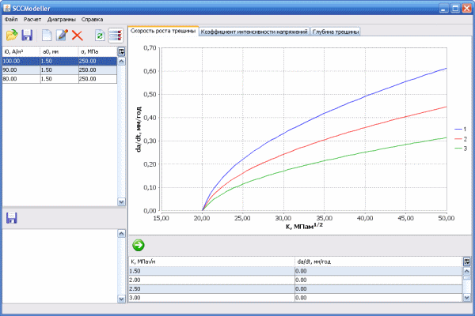

**SCCModeller**

Stress Corrosion Cracking Modeller

Modelling of stress corrosion cracking process. Calculation of the dependence of the crack growth rate on the stress intensity factor. Calculation of the dependence of the stress intensity factor on the depth of the crack. Calculation of the dependence of the crack depth on time.

